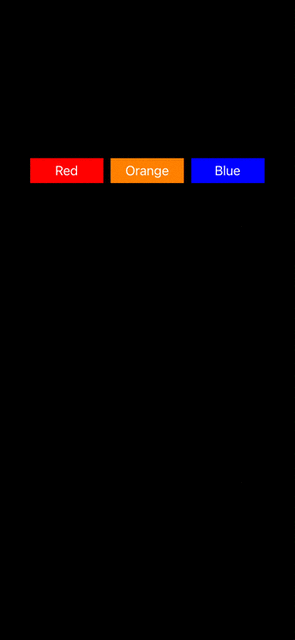

# Background Color Changer

## About
This is a programmatic UIKit iOS app that has one screen with three buttons. Pressing on each button will change the background color of the entire screen to match the color of the button.

## Tech Stack
- UIKit
- Swift
- Xcode version 26.2

## Features
- Splash screen with app name
- Home screen with three buttons that change the background color of the screen to match button color

## Demo

